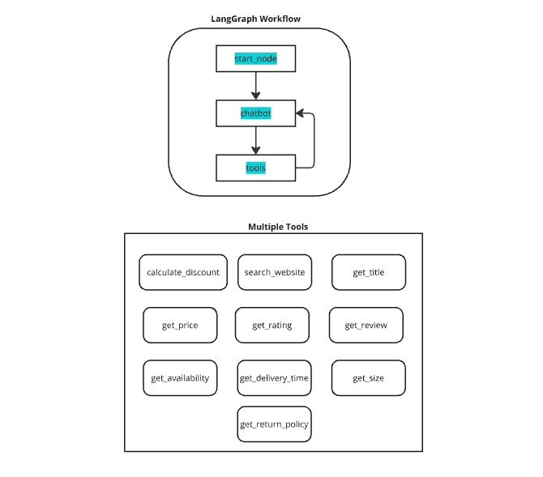

# website-scraping-chatbot

I have developed a interactive chatbot using LangGraph that processes user queries, scrapes website data, and generates responses. The workflow architecture uses multiple tools to generates the final response. It also utilizes short-term memory to track previous conversations, allowing users to retrieve past search results if needed. The chatbot provides at least 3-4 scraped results in response, enabling users to select a specific result and inquire further for more details.

### Comparative Conceptual Map 
  1. The user submits a query to the chatbot.
  2. The chatbot determines whether to utilize the appropriate tools based on the query.
  3. Multiple tools, as shown in the image below, are used to generate the required output.
  4. The retrieved response is sent back to the chatbot.
  5. The chatbot refines the response and presents the final output to the user.

The chatbot provides all the essential details like disscount, price, size, return policy, delivery date, shipping detail, etc. (as shown in the provided samples). If you need additional information about a specific product detail, simply ask the chatbot, and it will respond accordingly.  

### Results of the chatbot (Example Search)

1. Searched for **Sports jacket under price 3000**
   - Asked link for the search result and verify that its sports jacket and under 3000
   - Get all the necessary information like delivery date, size etc.
   - Specify asked for return policy
  

2. Searched for **black shoes**
   - Asked link for the search result and verify that its black shoes
   - Applied discount code and get the final price

### Short Written Analysis
The chatbot consistently delivers accurate results when given all the necessary information.

### Challenges & Improvements 
1. One limitation of this code is that the chatbot is specifically designed to scrape data only from Amazon.in and is not adaptable to other websites. An improvement I aim to make is to generalize it for scraping any website.
2. The web scraping is little slow and could be optimized. 
3. I was not able to deploy this code as I was bit occupied 😅.
